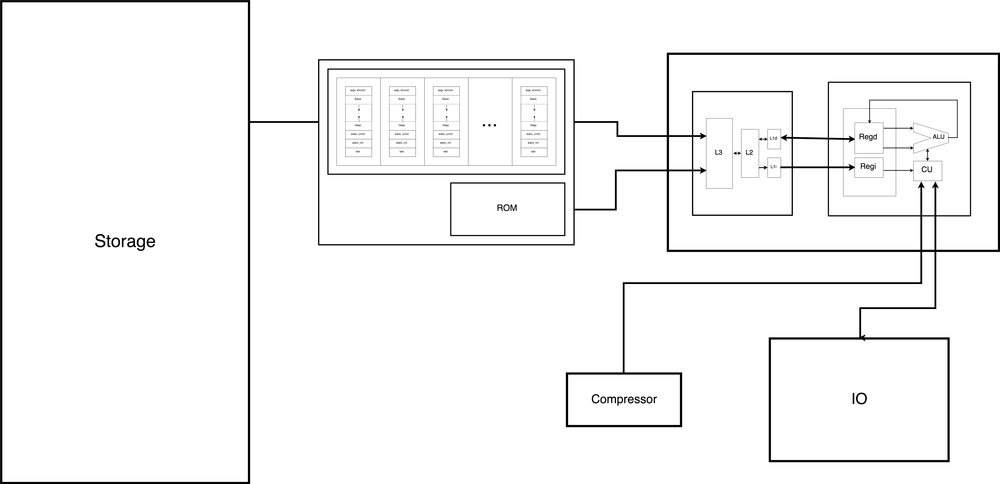

# VNMulator

### Description
VNMulator is 64-bit Von Neumann Machine emulator written in C++.

### Usage
```shell
$ git init
$ git clone https://github.com/keiferchiang/VNMulator.git
$ cd VNMulator
$ ./compile
$ ./vnm [program.vnm]
```

## Preliminary Design

### Instructions
VNMulator operates on a few x86 8086 inspired instructions. The following instructions are supported:

| OP    | Num  | Description                            | Notes                                         |
|-------|------|----------------------------------------|-----------------------------------------------|
| ADD   | 0x00 | $r[A] := $r[A] + $r[B]                 |                                               |
| AND   | 0x01 | $r[A] := $r[A] & $r[B]                 |                                               |
| CALL  | 0x02 | jump to $r[A]; start call procedure    |                                               |
| CMP   | 0x03 | compare $r[A] and $r[B]; set flags     | sets $E, $G, and/or $L flags                  |
| DEC   | 0x04 | $r[A] := $r[A] - 1                     |                                               |
| DIV   | 0x05 | $r[A] := $r[A] / $r[B]                 | unsigned integer division                     |
| HLT   | 0x06 | halt                                   |                                               |
| IDIV  | 0x07 | $r[A] := $r[A] / $r[B]                 | signed integer division                       |
| IMUL  | 0x08 | $r[A] := $r[A] * $r[B]                 | signed integer multiplication                 |
| IN    | 0x09 | $r[A] := char from stdin               |                                               |
| INC   | 0x0A | $r[A] := $r[A] + 1                     |                                               |
| Jcc   | 0x0B | jump to $r[A] if flags are set         | supports JE, JNE, JGE, JG, JLE, and JL        |
| JMP   | 0x0C | jump to $r[A]                          |                                               |
| LEA   | 0x0D | $r[A] := &($r[B])                      |                                               |
| MOD   | 0x0F | $r[A] := $r[A] % $r[B]                 |                                               |
| MOV   | 0x10 | $r[A] := $r[B]                         |                                               |
| MUL   | 0x11 | $r[A] := $r[A] * $r[B]                 | unsigned integer multiplication               |
| NAND  | 0x12 | $r[A] := ~($r[A] & $r[B])              |                                               |
| NEG   | 0x13 | $r[A] := -$r[A]                        | two's complement                              |
| NOP   | 0x14 | no operation                           |                                               |
| NOT   | 0x15 | $r[A] := ~$r[A]                        | one's complement                              |
| OR    | 0x16 | $r[A] := $r[A] &#124; $r[B]            |                                               |
| OUT   | 0x17 | stdout := $r[A]                        |                                               |
| POP   | 0x18 | $r[A] := top of stack; pop stack       |                                               |
| POPF  | 0x19 | set flag(s) from stack; pop stack      |                                               |
| PUSH  | 0x1A | push $r[A] on stack                    |                                               |
| PUSHF | 0x1B | push flag(s) on stack                  |                                               |
| RET   | 0x1C | calls next instruction                 |                                               |
| SAL   | 0x1D | $r[A] := $r[A] << $r[B]                | signed shift left                             |
| SAR   | 0x1E | $r[A] := $r[A] >> $r[B]                | signed shift right                            |
| SHL   | 0x1F | $r[A] := $r[A] << $r[B]                | unsigned shift left                           |
| SHR   | 0x20 | $r[A] := $r[A] >> $r[B]                | unsigned shift right                          |
| SUB   | 0x21 | $r[A] := $r[A] - $r[B]                 |                                               |
| TEST  | 0x22 | set $S flag if $r[A] < 0               |                                               |
| XOR   | 0x23 | $r[A] := $r[A] ^ $r[B]                 |                                               ||

### Flags
```c++
char flags = 0b00000000
               ^^^^
               SEGL
```
- $S: signed flag
- $E: equality flag
- $G: greater-than flag
- $L: less-than flag

### Design


For more information, see <code>./design/DESIGN.md</code>

### Implementation Details

| Process/Module        | Implementation Status | Interface             | Implementation                        |
|-----------------------|-----------------------|-----------------------|---------------------------------------|
| Design                | In progress           | n/a                   | n/a                                   |
| Main                  | Waiting               | n/a                   | src/main.cpp                          |
| VNMulator             | Waiting               | include/vnmulator.h   | src/vnmulator.cpp                     |
| CPU                   | Waiting               | include/cpu.h         | src/modules/cpu.cpp                   |
| Cache                 | Waiting               | include/cache.h       | src/modules/cpu/cache.cpp             |
| L1d                   | Waiting               | include/l1d.h         | src/modules/cpu/cache/l1d.cpp         |
| L1i                   | Waiting               | include/l1i.h         | src/modules/cpu/cache/l1i.cpp         |
| L2                    | Waiting               | include/l2.h          | src/modules/cpu/cache/l2.cpp          |
| L3                    | Waiting               | include/l3.h          | src/modules/cpu/cache/l3.cpp          |
| Core                  | Waiting               | include/core.h        | src/modules/cpu/core.cpp              |
| ALU                   | Waiting               | include/alu.h         | src/modules/cpu/core/alu.cpp          |
| CU                    | Waiting               | include/cu.h          | src/modules/cpu/core/cu.cpp           |
| Registers             | Waiting               | include/registers.h   | src/modules/cpu/core/registers.cpp    |
| Memory                | Waiting               | include/memory.h      | src/modules/memory.cpp                |
| RAM                   | Waiting               | include/ram.h         | src/modules/memory/ram.cpp            |
| Segment               | Waiting               | include/segment.h     | src/modules/memory/ram/segment.cpp    |
| ROM                   | Waiting               | n/a                   | src/modules/memory/ROM                |
| I/O                   | Waiting               | include/io.h          | src/modules/io.cpp                    |
| Data Compressor       | Waiting               | include/compressor.h  | src/modules/compressor.cpp            |
| Storage               | Waiting               | n/a                   | src/modules/storage                   ||
### Notes
- VNMulator currently does not support IEEE floating-point representations
- RAM module design supports concurrency

### TODO
- OS
- Config CLI
- IEEE floating-point arithmetic
- Assembler
